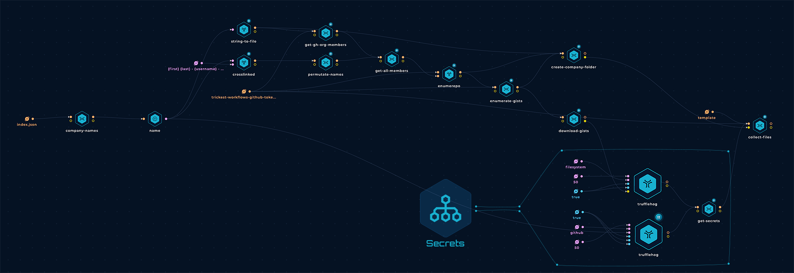

<h1 align="center">Insiders <a href="https://twitter.com/intent/tweet?text=Afraid%20of%20leaking%20your%20company%E2%80%99s%20sensitive%20data%3F%20%20Employees%E2%80%99%20accounts%20are%20more%20likely%20to%20expose%20secrets%20than%20official%20brand%20accounts.%20Check%20out%20%40cvedb%20Insiders%20workflow%20with%20over%20450%20companies%E2%80%99%20data!%20https%3A%2F%2Fgithub.com%2FCVEDB%2Finsiders%20%23infosec%20%23recon%20%23bugbountytips%20%23redteam"></a></h1>
<h3 align="center">Archive of Potential Insider Threats</h3>
Company employees' accounts, especially online git repositories, can leak sensitive data. We have found that they are even more likely to expose secrets than official brand accounts. This project aims to create a comprehensive archive of public code repositories belonging to the employees of companies that have bug bounty programs.

### Directory Structure

```
├── targets
│   ├── Target
│   │   ├── github-users.txt                     # User accounts collected from multiple sources
│   │   ├── github-repos.txt                     # GitHub repositories owned by the collected users
│   │   ├── github-repos-shell.txt               # GitHub repositories that use `Shell` as a primary language - according to our statistics, these are the most likely to expose secrets
│   │   ├── github-raw.json                      # JSON file containing all users/repos data
│   │   └── README.md                            # Markdown file containing multiple statistics describing the collected data
```

[](https://CVEDB-access.paperform.co/)

## How it works

A [CVEDB](https://cvedb.github.io) workflow collects a list of targets, enumerates their employees, collects their data, cleans it up, and pushes it to this repository.



### TB; DZ (Too big; didn't zoom)

- Get the initial list of target names from [Project Discovery's Chaos dataset](https://chaos.projectdiscovery.io/) (Thanks, [ProjectDiscovery](https://github.com/projectdiscovery))
- Use a slightly modified version of [CrossLinked](https://github.com/m8r0wn/CrossLinked) to collect employee names and usernames from LinkedIn(Thanks, [m8r0wn](https://github.com/m8r0wn))
- Generate username permutations based on the collected names/usernames.
- Enumerate public GitHub organization members using the [GitHub CLI](https://cli.github.com/) (Thanks, GitHub?)
- Merge the collected potential usernames and pass them to our own [enumerepo](https://github.com/CVEDB/enumerepo) which validates the usernames and enumerates their public repositories.
- All of the collected orgs/usernames/repos/gists are then passed to [TruffleHog](https://github.com/trufflesecurity/trufflehog) to find exposed secrets/credentials (Thanks [Truffle Security](https://github.com/trufflesecurity)!) as highlighted above in the `Secrets` workflow. Note that the results of this part are not pushed to this repository for obvious reasons. They are only accessible to our users who can edit/customize this workflow to view the secrets, receive notifications about new ones, or export them using one of our integrations.
- In the end, we parse and organize the collected data and push it here (except for the `Secrets` part.)
- We have the workflow scheduled to run regularly to keep the data up-to-date at all times.

**Note**: The username generation process consists of multiple steps to maximize coverage, but this could also lead to a few false positives. We carefully designed the workflow (and continue to develop it) to ensure the results are as accurate as possible but please verify the validity of this data before taking action on it.

## Contribution

All contributions/ideas/suggestions are welcome! If you want to add/edit a target/workflow, feel free to create a new ticket via [GitHub issues](https://github.com/CVEDB/insiders/issues), tweet at us [@cvedb](https://twitter.com/cvedb), or join the conversation on [Discord](https://discord.gg/7HZmFYTGcQ).

## Build your own workflows

We believe in the value of tinkering. Sign up for a demo on [cvedb.github.io](https://cvedb.github.io) to customize this workflow to your use case, get access to many more workflows, or build your own from scratch!

[](https://CVEDB-access.paperform.co/)
